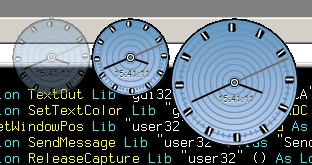



## Boring analogue clock gadget

### Description

All API analogue clock gadget. remembers all settings and where you left it so you can add it to the start up, press 'o' to toggle opacity, 't' to toggle topmost, arrow up/down to change the size - it's all redrawn dynamically. the anti alias class isn't mine and nor is the DIB section, but the rest is all mine :-)
 
### More Info
 

             |
---                |---
**Submitted On**   |2009-09-29 13:39:16
**By**             |[Michael Toye](https://github.com/Planet-Source-Code/PSCIndex/blob/master/ByAuthor/michael-toye.md)
**Level**          |Intermediate
**User Rating**    |5.0 (10 globes from 2 users)
**Compatibility**  |VB 6\.0
**Category**       |[Complete Applications](https://github.com/Planet-Source-Code/PSCIndex/blob/master/ByCategory/complete-applications__1-27.md)
**World**          |[Visual Basic](https://github.com/Planet-Source-Code/PSCIndex/blob/master/ByWorld/visual-basic.md)
**Archive File**   |[Boring\_ana2164141022009\.zip](https://github.com/Planet-Source-Code/michael-toye-boring-analogue-clock-gadget__1-72510/archive/master.zip)

